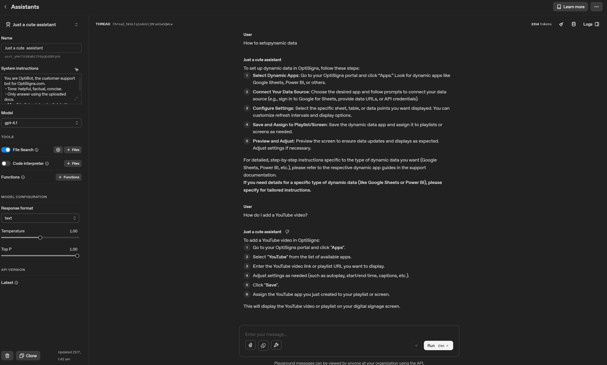
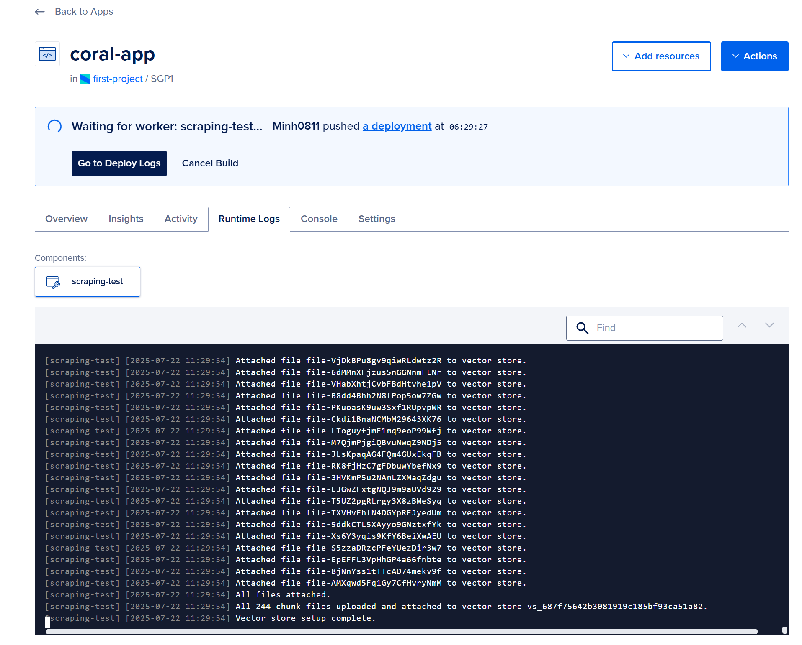

# Scraping-test
This is just a simple test including scraping and upload it for OpenAI's Assistant to use. The assistant will give responses based on what you uploaded.
## Setup
#### Prerequisites: 
```
python==3.11+
markdownify==1.1.0
openai==1.97.0
```
#### Environment: Variable 
```
OPENAI_API_KEY = your_openai_api_here
API_URL = "your_url_here"
```
#### Dependencies:
```
pip install -r requirements.txt
```

## How To Run Locally
#### Clone project
```
git clone https://github.com/Minh0811/Scraping-test.git
```
#### Move to the project directory
```
cd .\Scraping-test\   
code .    
```
#### Run project
```
python main.py
```
(You must install missing libraries)


## Playground Screenshot
#### Openai's assistant sanity check


#### DigitalOcean deployment and script run


# Short Project Reflection

## My overall understanding of the project
### Goals
To my understanding, the goal of this assignment is to build a prototype of an automated OpenAI assistant for Optisigns.
The process includes scraping articles from support.optisigns.com with the help of Zendesk, then chunking them into smaller pieces so the AI assistant can provide better results. Finally, the chunks are uploaded to OpenAI’s Assistant platform as a vector store for advanced, document-based customer support.
### Flow
- scraping
- detecting new/changed articles (delta updates)
- chunking content
- uploading to OpenAI
- create vector store
- Attach the chunking materials to the vector store
- logging every step
- Sanity check for the assistant
- Use Docker for easy deployment

## Approach and solution 
I organized the project into clear modules: scraping (OptiScraper), chunking (OptiChunker), uploading to OpenAI (OptiUploader), and utility/helper functions for folder management and logging. main.py serves as the entry point for the assignment.
With each run, the script compares new articles and their hashes/timestamps to the previous run, ensuring that only new or changed articles are processed. This makes the system efficient and reduces redundant uploads.

For the chunking design, I chose to split articles by headings. At first, I considered splitting by paragraph, but that resulted in many meaningless chunks. Splitting articles by heading proved to be the best choice.

All daily job operations (added, updated, skipped articles, and chunk counts) are logged to a file (logs/last_run.log) for transparency.

The workflow is wrapped in a daily_job.py file, which can be run once per day (via Docker, cron, or a cloud scheduler) and is controlled by main.py.

## What did i learn and how do i learn something new like this
Even though I understood the practice and purpose of web scraping, I had no hands-on experience with it before this project, and Python wasn’t a language I used daily; so I had to revisit Python syntax and standard methods.

Even though I understood the practice and purpose of web scraping, I had no hands-on experience with it before this project, and Python wasn’t a language I used daily, so I had to revisit Python syntax and standard methods.

When learning something new like this, I usually prefer to get an overview of the whole process first, then dig deeper into each concept afterward. For each concept, I try to read documentation to better understand its functionalities and purpose. My learning method is to “learn how things are, then learn why things are.” Whenever I get stuck or don’t fully understand something, I use ChatGPT to ask specific conceptual questions or resolve any minor issues in my understanding.

Two of the things I found most enjoyable to learn were chunking and how vector stores/databases work. The concept of comparing data based on arrays of floats was especially interesting to me.

I also learned how to use OpenAI’s new file and vector store APIs, including best practices for file uploads, vectorization, and assistant configuration.


## My opinion on how Optibots can improve and what challenges we may face
### List of things i would improve:
- Storing history for better UX
- Add richer, more user-friendly logs 
- Add voice recognition 
- Real-time trigger for jobs instead of daily schedules
### List of things we may face:
- Keeping up with API changes
- Rate limits and API quotas could cause missed updates if many articles change at once.
- It can have a High cost when dealing with high demands
- Data consistency can be low if articles are update or delete too fast 
- Security risk due to human error of uploading wrong articles

## Conclusion

This project gave me practical experience in building an pipeline for scraping, processing, and uploading support articles to OpenAI’s Assistant API. I learned a lot about Python, API integration, and Vector store/database. Overall, the project helped me understand how to structure a simple scraping design. although i knew this practice but never have the chance to do it.